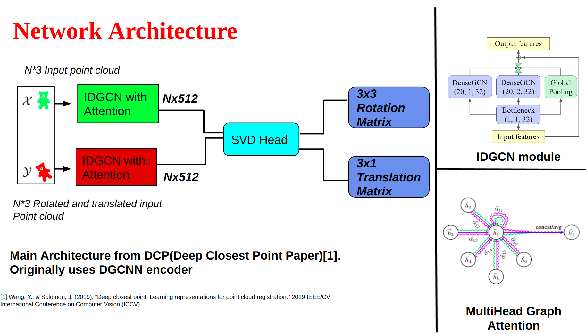
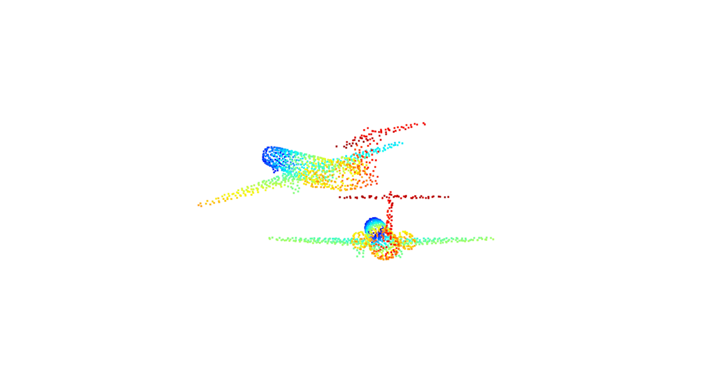
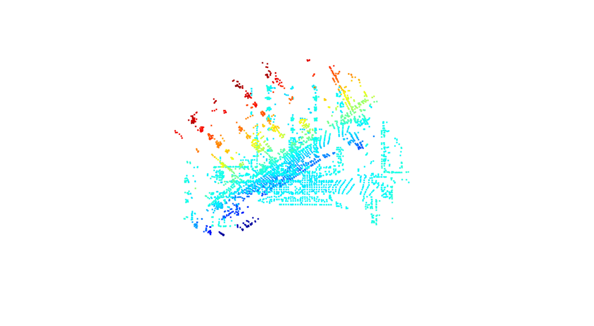

# Deep-Learning-ICP

The model uses Graph attention layers to extract features from the two point clouds required for registration

<p align="center" width="100%">
     Deep Learning Architecture of Registration
    
</p>

<p align="center" width="100%">
    Results of point cloud registration on ModelNet40 dataset.
    
</p>

<p align="center" width="100%">
    Results of point cloud registration on KITTI downsampled lidar frames.
    
</p>

To train the model &nbsp;
``` python3 main.py ```
``` optional arguments:
  -h, --help            show this help message and exit
  --exp_name N          Name of the experiment
  --model N             Model to use, [dcp]
  --emb_nn N            Embedding nn to use, [pointnet, dgcnn]
  --pointer N           Attention-based pointer generator to use, [identity, transformer]
  --head N              Head to use, [mlp, svd]
  --emb_dims N          Dimension of embeddings
  --n_blocks N          Num of blocks of encoder&decoder
  --n_heads N           Num of heads in multiheadedattention
  --ff_dims N           Num of dimensions of fc in transformer
  --dropout N           Dropout ratio in transformer
  --batch_size batch_size
                        Size of batch)
  --test_batch_size batch_size
                        Size of batch)
  --epochs N            number of episode to train
  --use_sgd             Use SGD
  --lr LR               learning rate (default: 0.001, 0.1 if using sgd)
  --momentum M          SGD momentum (default: 0.9)
  --no_cuda             enables CUDA training
  --seed S              random seed (default: 1)
  --eval                evaluate the model
  --cycle N             Whether to use cycle consistency
  --gaussian_noise N    Wheter to add gaussian noise
  --unseen N            Wheter to test on unseen category
  --num_points N        Num of points to use
  --dataset N           dataset to use
  --factor N            Divided factor for rotations
  --model_path N        Pretrained model path
  --agg_fun_name N      agg functions to use 
```


This repo contains code from [Deep Closest Point](https://github.com/WangYueFt/dcp)
